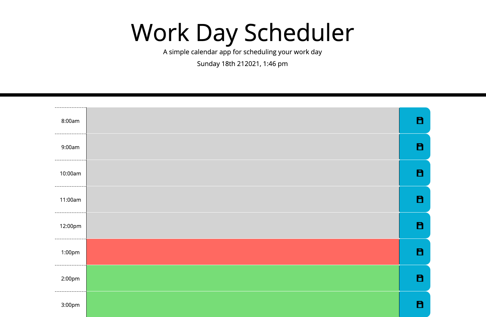

# Work-Day-Scheduler

## Goal: 

Create a Work Day Scheduler using Javascript/jquery/local storage/Moment.js library concepts.

## User Story:

* As a user needing an electronic day timer to keep an organized schedule, I would like to be able to add notes for certain business hours of the day.

* Upon opening the application in the browser, the current day and time is displayed at the top. The current hour is highlighted in red, while previous hours are highlighted in gray, and future hours are highlighted in green. 

* Upon clicking on the save button, the text is saved into local storage and will persist on page until window is closed.

## Deployment

Page is deployed using [GitHub](https://sarahbinaz1020.github.io/Work-Day-Scheduler/index.html)

## Questions

If you have any questions about the repo, open an issue or contact me directly at sarahbinaz1020@gmail.com. You can find more of my work at [Sarah Bonnell](https://github.com/sarahbinaz1020/).
